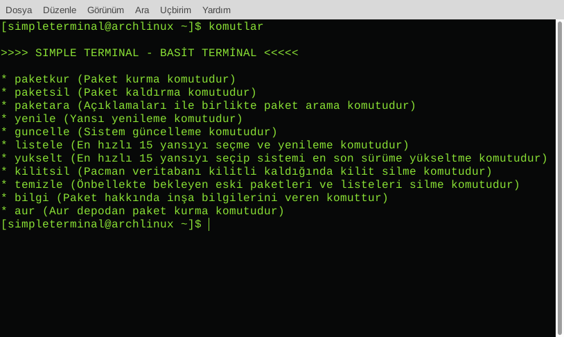

# Simple Terminal

**Simple Terminal, Arch Linux ve Arch Linux tabanlı dağıtımlarda hızlı ve basitçe uçbirimi (Linux terminali) kullanmak için geliştirilmiş bir terminal uygulamasıdır.**

Simple Terminal (Basit Terminal) sayesinde GNU Linux dağıtımınızda zorlu komutları ezberlemeden paket kurma, paket kaldırma, güncelleme, sürüm yükseltme gibi işlemlerinizi kolayca halledebilirsiniz. Simple Terminal [komutları](#Komutlar) Türkçedir ve komut açıklamaları [Yardım](#Komut-Yardımı) sayfasında bulunmaktadır.

Simple Terminal, AUR depoları ile de uyumludur. Arch Linux ve Arch Linux tabanlı her dağıtıma kolayca [kurulabilir](#Kurulum)



# Komutlar

* **paketkur** (Paket kurma komutudur)
* **paketsil** (Paket kaldırma komutudur)
* **paketara** (Açıklamaları ile birlikte paket arama komutudur)
* **yenile** (Yansı yenileme komutudur)
* **guncelle** (Sistem güncelleme komutudur)
* **listele** (En hızlı 15 yansıyı seçme ve yenileme komutudur)
* **yukselt** (En hızlı 15 yansıyı seçip sistemi en son sürüme yükseltme komutudur)
* **kilitsil** (Pacman veritabanı kilitli kaldığında kilit silme komutudur)
* **temizle** (Önbellekte bekleyen eski paketleri ve listeleri silme komutudur)
* **bilgi** (Paket hakkında inşa bilgilerini veren komuttur)
* **aur** (Aur depodan paket kurma komutudur)

# Komut Yardımı

Terminalde (Uçbirimde) **komutlar** yazarak kolayca komutlar hakkında yardım ve açıklama bölümüne ulaşabilirsiniz.

# Kurulum

Kurulum için aşağıdaki komutları sırasıyla **terminale (uçbirime)** yazmanız ve her komuttan sonra enter tuşuna basarak komutları uygulamanız yeterlidir.

```
wget https://github.com/fintuxtr/simpleterminal/archive/master.zip
unzip master.zip
cd simpleterminal-master
mv .simpleterminal .bashrc .zshrc ~/
```

**Hatırlatma:** Simple Terminal bilgisayarınızın Ev Dizinine (/home/kullanıcıadı) kurulan bir uygulamadır. Çalışması için kullanmak istediğiniz oturumdan çıkış yapıp tekrar girmeniz veya bilgisayarınızı bir kez yeniden başlatmanız yeterli olacaktır.
